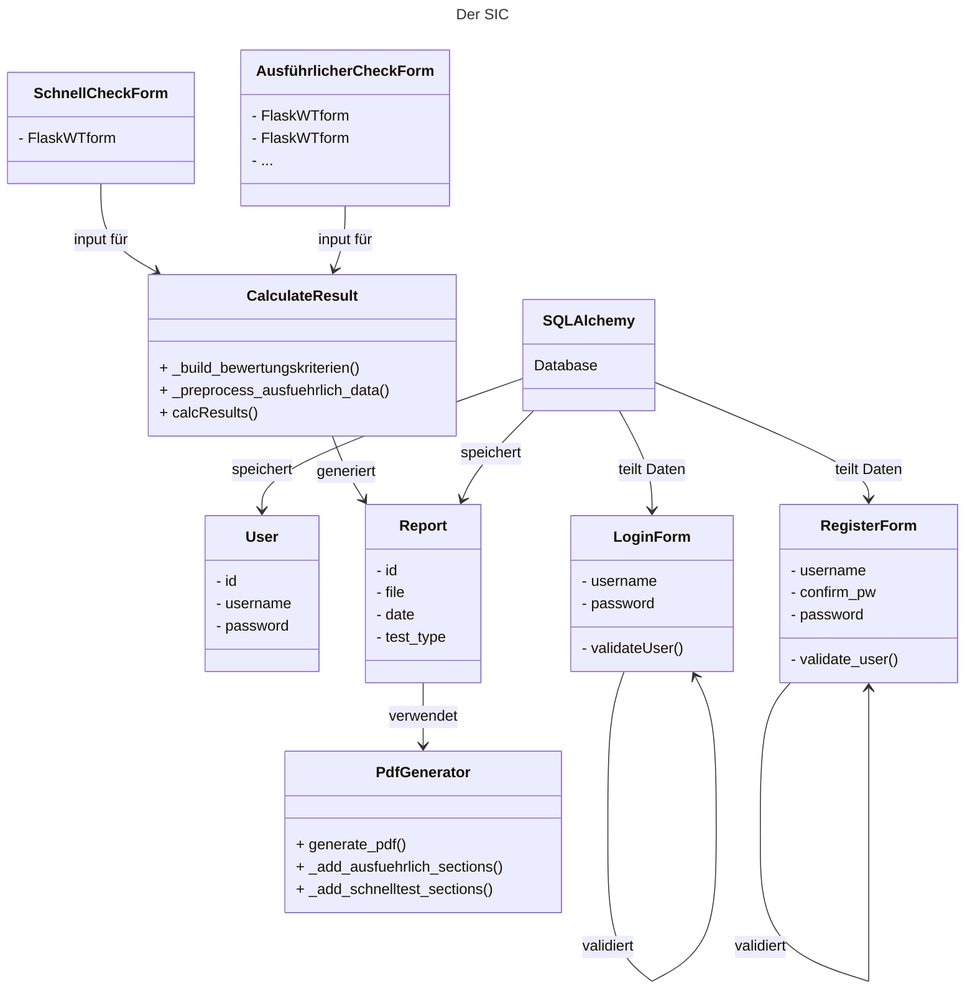

{: .label }
Nayon Lenz

{: .no_toc }
# Architecture

{: .text-delta }

Table of contents

+ ToC
{: toc }

## Overview

Unsere App ermöglicht es dem Nutzer zwei Checks für deren Steuersituation auszuführen. Wir haben einen SchnellCheckForm, welcher ohne Anmeldung zugänglich ist und einen Ausführlichen Check, welcher eine Anmeldung benötigt. Sobald der Nutzer angemeldet ist, werden seine Checks in einer Datenbank gespeichert. Die Checks werden mit einem Punktesystem ausgewertet und mit einer Ampel bewertet (Rot, Schlecht; Gelb, Okay; Grün, Gut). Der Nutzer bekommt sein Ergebnis und hat die Möglichkeit sein Ergebnis als PDF herunterzuladen. Die PDF wird mithilfe der Nutzereingaben individuell erstellt. Ergebnisse (Nachhaltigkeitsberichte) werden in der Datenbank gespeichert und der Nutzer bekommt in einem Privaten Bereich die Möglichkeit frühere Checks einzusehen, herunterzuladen und zu löschen.

Man orientiere sich an den folgendem Diagramm:

## Codemap

### 1. Datamodel
Alle Datenmodell-Klassen und Datenbankoperationen befinden sich in `db.py`:
- class User 
- class Report

### 2. Forms
Bearbeitung jeglicher Forms kann an folgenden Stellen vorgenommen werden:

`AusführlicherCheckForm.py`:
- class AusführlicherCheckForm1
- class AusführlicherCheckForm2
- class AusführlicherCheckForm3
- class AusführlicherCheckForm4
- class AusführlicherCheckForm5

`SchnellCheckForm.py`:
- class SchnellCheckForm

`db.py`:
- class RegisterForm
- class LoginForm

### Logik der Checks
Das Test Limit kann in app.py bestimt werden in der Variable "MAX_REPORTS_PER_USER"

**Schnellcheck:**
- `app.py`, app.route('schnelltest')
- `PDFGenerator.py`
- `CalculateResult.py`
**Ausführlicher Check:**
- `app.py`, app.route('ausführlicherTest')
- `PDFGenerator.py`
- `CalculateResult.py`

### Handhaben von Reports

**Generieren:**
- `PDFGernerator.py`

**Herunterladen:**
- `app.py`, app.route('/download/<'Filename'>'), (Direkt nach den Tests)
- `app.py`, @app.route('/download_pdf/<'int:report_id'>'), (In "Mein Bereich" von der Datenbank aus)

**Löschen**
- `app.py`, app.route('/deleteReport')

**Speichern in der Datenbank:**
- `app.py`, app.route('schnelltest')
- `app.py`, app.route('ausführlicherTest')

### Frontend `/templates`
- Inline styling mit Bootstap und Funtion mit Jinja

## Architecture Invariants

### 1. Trennung von Verantwortlichkeiten
- Alle datenbankbezogenen Operationen befinden sich in `db.py`.
- Formularlogik ist in separate Dateien ausgelagert, um Modularität und Wartbarkeit zu gewährleisten.
- Routen sind in `app.py` definiert und verweisen auf Hilfsklassen für Berechnungen, PDF-Erstellung und Datenbankoperationen.

### 2. State Management
- **Session Management:** Die Flask-Session wird verwendet, um Check-Daten und Status (Schnell oder Ausführlich) zwischen Routen zu speichern.
- **Datenbank:** Angemeldete Nutzer können ihre Berichte abrufen, da diese persistiert werden.

### 3. Fehlerbehandlung
- **Formulare:** Validierungslogik (z. B. maximale Berichte pro Nutzer) ist zentral in den Formular-Klassen definiert.
- **PDF-Fehler:** Falls bei der Generierung ein Fehler auftritt, wird dies dem Nutzer mit einer klaren Fehlermeldung angezeigt.

## Cross-cutting concerns

### Nutzervewaltung
Für die Nutzerverwaltung nutzen wir ``flask_login_manager`` und validieren den Nutzer aus unserer Datenbank.

### Logik des Ausführlichen Tests
Die Tests sind in zwei aufgeiteilt (Schnell/Ausführlich) und während der Schnelle aus einem Formular besteht, ist der zweite aus mehreren Formularen. Die Daten werden zwischen gespeichert mit `flask_session`. Wir verwenden Schritte in ``app.py`` um darzustellen bei welchem Formular wir uns derzeit befinden.

### Error handling
Wir nutzen ``flask_flash`` sowie das integrierte Error handling von ``Flask WTF``.

### SQLAlchemy

Wir nutzen SQLAlchemies ORM für unsere App. Siehe [[Standard sql vs SQLAlchemy](docs\design-decisions.md)]. Zudem verwenden wir die seit ``SQLALchemy 2.0`` eingeführte ``execite API`` anstelle der bekannten ``query API`` für ``READ`` Operationen.

