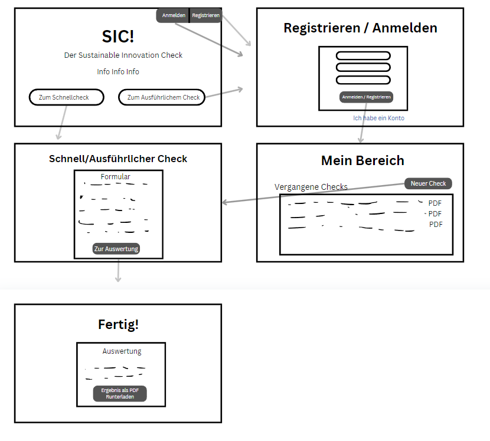

{: .label }
Nayon Lenz

{: .no_toc }
# Value proposition

{: .text-delta }

Table of contents

+ ToC
{: toc }

## The problem

Ein Imbiss besitzer, der ich nicht mit den Steuergesetzen, möglicher Weise noch aus dem Ausland kommt und kaum die Steuergesetze Deutschlands versteht, möchte sein Betrieb Steuertranzparenter machen um Nachhaltiger zu wirtschaften. Da Gastrobetriebe öfters um das wirtschaftliche überleben kämpfen müssen, steht ein Steuerberater außer Frage. 

## Our solution

Der Sustainable Innovation Check soll klein bis mittleren Unternehmern die Chance geben sich kostengünstig, simpel und schnell Nachhaltig zu verhalten. In einem Online Check kann der Nutzer seine Situation beschreiben indem unser Team die relevante, rechtliche Lage verständnisvoll darlegt. Nach dem Check bekommt der Nutzer einen Nachhaltigkeitsbericht(Einschätzung), welche Ihm Probleme, mögliche Probleme und Verbesserung vorschlägt.

## Target user

 - **Primäre Zielgruppe:** Kleine und mittlere Unternehmen (KMUs) im Gastronomiebereich (Restaurants, Cafés, Imbisse), die steuerliche Transparenz verbessern möchten.
- **Sekundäre Zielgruppe:** Steuerberater und Buchhalter, die Gastronomie-KMUs unterstützen und Interesse an Transparenztools haben.

## Customer journey

1. Der Nutzer wird auf der Startseite mit Infos über den Check begrüßt, sowie mit den Auswahlmöglichkeiten einen SchnellCheckForm oder ausführlichen Check zu machen
2. Der SchnellCheckForm bringt den Nutzer direkt zu einem komprimierten Formular, um die wichtigsten Mängel herauszufinden.
3. Der ausführliche Check erfordert die Anmeldung vom Nutzer, nach welcher er in einen Privaten Bereich kommt mit vergangenen Checks. Hier sind ihm die Möglichkeiten geboten einen neuen Check zu machen oder einen alten einzusehen.
4. Nach Abschluss jenes Checks, folgt die Auswertung und die Möglichkeit die Ergebnisse herunterzuladen.

